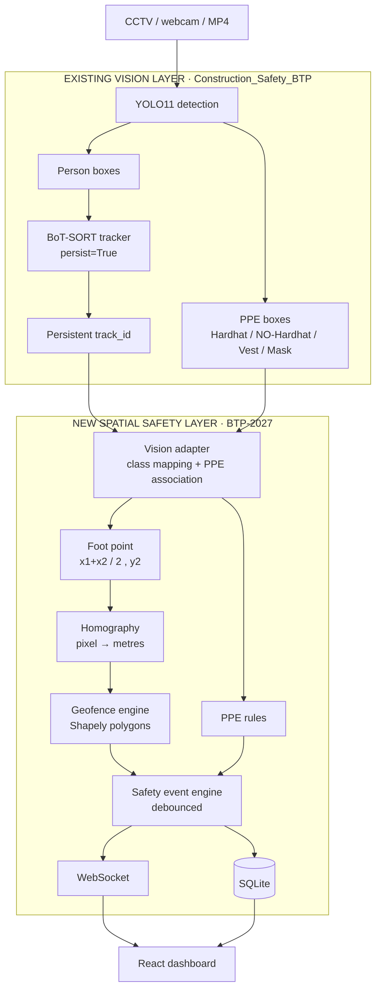

# BTP-2027 — AI-Driven Construction Site Safety Monitoring
### with Spatial Worker Tracking and Geofencing

Live worker **localisation** and **geofencing** on top of an existing CCTV
computer-vision pipeline.

The existing system answers **"who is this worker and what PPE are they
wearing?"**
This system answers **"where are they standing, and is that location safe?"**

---

## 1. Project objective

A construction site camera can already tell you that a person is present and
whether they are wearing a hardhat. It cannot tell you that they are standing
inside the crane's slewing radius, or two metres from an unprotected slab edge.

This project closes that gap. It takes the bounding boxes and persistent track
ids that the vision layer already produces, projects each worker's **ground
contact point** onto a plan of the site through a **homography**, and tests that
real-world position against **polygonal danger zones**. The result is a live
control-room dashboard with positions in metres, zone breaches, PPE violations,
attendance and movement history.

**The contribution is the integration**: vision + tracking + spatial
localisation + geofencing + safety events + real-time visualisation.

---

## 2. The two layers

| | **Vision layer** (existing) | **Spatial safety layer** (this repo) |
|---|---|---|
| Repository | [`darkm4tter07/Construction_Safety_BTP`](https://github.com/darkm4tter07/Construction_Safety_BTP) | `wotevr/BTP-2027` |
| Owns | video, YOLO11, person detection, PPE detection, BoT-SORT tracking, persistent track ids, bounding boxes | vision adapter, foot point, homography, world coordinates, geofencing, safety events, telemetry, attendance, database, WebSocket, dashboard, analytics |
| In this repo | vendored under [`upstream-vision/`](upstream-vision/) for convenience — **not rewritten** | `backend/` and `frontend/` |

**Nothing in the vision layer was rebuilt.** No model was retrained, no second
tracker was written, no PPE detector was replaced. The persistent `track_id`
assigned by BoT-SORT is consumed directly and becomes the worker id.

Full detail, including exactly what the upstream pipeline emits and how to wire
it up: **[`docs/INTEGRATION.md`](docs/INTEGRATION.md)**.

A measured technical review of that system, and the evidence motivating this
project: **[`docs/EXISTING_SYSTEM.md`](docs/EXISTING_SYSTEM.md)**.

---

## 3. Architecture



### The core new flow

```
tracked worker  →  bottom-centre of bbox  →  homography  →  real-world X,Y (metres)
                →  danger-zone intersection  →  safety event  →  database
                →  WebSocket  →  live construction safety dashboard
```

---

## 4. Folder structure

```
BTP-2027/
├── backend/
│   ├── app/
│   │   ├── main.py                     FastAPI app, lifespan, WS /ws/live
│   │   ├── api/
│   │   │   ├── routes_ingestion.py     POST /detections, demo mode, status
│   │   │   ├── routes_workers.py       workers, detail, trajectory
│   │   │   ├── routes_alerts.py        alert history + lifecycle
│   │   │   ├── routes_zones.py         danger-zone CRUD, site plan
│   │   │   ├── routes_analytics.py     aggregated metrics
│   │   │   └── routes_calibration.py   inspect / reload / project
│   │   ├── core/
│   │   │   ├── config.py               all settings, env-driven
│   │   │   └── websocket_manager.py    fan-out, timeouts, dead-client pruning
│   │   ├── database/
│   │   │   ├── database.py             engine, WAL, session scope
│   │   │   └── models.py               4 tables + UTCDateTime type
│   │   ├── schemas/                    detection, worker, alert, zone
│   │   ├── services/
│   │   │   ├── homography.py           ★ pixel ↔ metres, validation
│   │   │   ├── geofence_engine.py      ★ Shapely + enter/exit state machine
│   │   │   ├── alert_service.py        ★ debouncing + ACTIVE/RESOLVED
│   │   │   ├── fusion_engine.py        ★ the orchestrator
│   │   │   ├── worker_service.py       live state + attendance policy
│   │   │   ├── persistence.py          async DB writer (never blocks)
│   │   │   └── demo_simulator.py       demo mode, through the real pipeline
│   │   └── vision/
│   │       └── vision_adapter.py       ★ THE INTEGRATION BOUNDARY
│   ├── scripts/
│   │   ├── calibrate_homography.py     interactive calibration tool
│   │   ├── seed_demo_data.py           zones + site plan + demo calibration
│   │   └── yolo_bridge.py              ★ live bridge to the upstream pipeline
│   ├── tests/                          130 tests
│   ├── data/
│   │   ├── calibration/homography.json
│   │   └── site_map/site_plan.json
│   ├── requirements.txt
│   └── .env.example
│
├── frontend/
│   └── src/
│       ├── components/
│       │   ├── SiteMap.jsx             ★ custom 2D site plan, pan/zoom
│       │   ├── Dashboard.jsx           live monitor
│       │   ├── AlertFeed.jsx           real-time alert panel
│       │   ├── WorkerDetail.jsx        position, PPE, history
│       │   ├── WorkerTable.jsx         sortable attendance
│       │   ├── Analytics.jsx           metrics and breakdowns
│       │   ├── ZoneManager.jsx         zone CRUD
│       │   └── Header.jsx
│       ├── hooks/useWebSocket.js       reconnect + heartbeat
│       ├── services/api.js
│       └── lib/format.js
│
├── upstream-vision/                    vendored copy of the vision layer
├── docs/INTEGRATION.md                 ★ how the two repos connect
└── README.md
```

---

## 5. Quick start

### Fastest path (Windows)

```powershell
.
un.ps1 -Setup      # first time only: venv, deps, seed the database
.
un.ps1             # whole product on http://localhost:8000
.
un.ps1 -Public     # ...and a public https:// URL for a remote demo
.
un.ps1 -Dev        # hot-reload mode: Vite on :5173, API on :8000
```

In the default mode FastAPI serves the built dashboard itself, so the page,
the REST API, the WebSocket and `/docs` are all on **one port** - which is what
lets a single tunnel expose the whole product.

### Manual

Two terminals. Python 3.12+ and Node 20+.

### Terminal 1 — backend

```bash
cd backend
python -m venv venv
venv\Scripts\activate          # Windows
# source venv/bin/activate     # macOS / Linux

pip install -r requirements.txt
copy .env.example .env         # cp on macOS/Linux

python scripts/seed_demo_data.py
python -m uvicorn app.main:app --reload --port 8000
```

API docs: **http://localhost:8000/docs**

### Terminal 2 — frontend

```bash
cd frontend
npm install
npm run dev
```

Dashboard: **http://localhost:5173** → click **Start Demo**.

> The backend never opens a camera and never imports torch. It consumes
> detections over HTTP. That is what keeps it light and testable.

---

## 6. Database

SQLite via SQLAlchemy, created automatically at `backend/data/btp.db`.

| Table | Holds |
|---|---|
| `worker_attendance` | one row per track id: first/last seen, time on site, status, last position, incident count |
| `location_telemetry` | sampled positions, **both pixel and world** so a recalibration can be re-applied to history |
| `safety_alerts` | every event with severity, zone/PPE item, world position, ACTIVE/RESOLVED lifecycle |
| `danger_zones` | polygon in site metres, type, severity, active flag |

Writes never happen on the hot path. `services/persistence.py` queues records
and flushes them in batches on a background task, in a worker thread, so neither
the ingestion request nor the WebSocket broadcast ever waits on SQLite. WAL mode
lets the API read while the writer commits.

Telemetry is sampled per worker (`TELEMETRY_SAMPLE_INTERVAL`, default 0.5 s),
not per frame.

---

## 7. Homography calibration

### What you are doing

Telling the system how pixels correspond to metres on the ground. You need **at
least four points** that lie on the ground plane, are visible in the camera, and
whose real positions you can measure.

Good choices: corners of a concrete slab, painted bays, the base corners of a
fenced compound, or four cones you place and measure with a tape.

Pick an origin (say the south-west corner) and an axis direction. Everything is
metres from that origin.

### Running the tool

```bash
cd backend

# click the points on a saved frame
python scripts/calibrate_homography.py --image frame.jpg

# or grab a frame from a video / webcam / RTSP stream
python scripts/calibrate_homography.py --video ../video/site.mp4

# or type the numbers, no image needed
python scripts/calibrate_homography.py --interactive
```

Click each ground point, type its world X and Y, press `u` to undo, `q` when
done. The tool prints the matrix, the **mean reprojection error**, and a
round-trip sanity check, then writes `data/calibration/homography.json`.

Reload it without restarting:

```bash
curl -X POST http://localhost:8000/api/v1/calibration/reload
```

### Reading the error

| Error | Meaning |
|---|---|
| < 3 px | excellent |
| 3–10 px | acceptable; re-measure the worst point |
| > 10 px | a point was mis-clicked, two were swapped, or one is not on the ground |

It refuses, with a specific message, on: fewer than four points, mismatched
counts, duplicate points, three or more collinear points, non-numeric values,
NaN, a singular matrix, or a failed `cv2.findHomography`.

### Why the foot point

```
bbox = [x1, y1, x2, y2]
u = (x1 + x2) / 2
v = y2              ← the BOTTOM edge, not the centre
```

A homography is only valid for points **on the ground plane**. The centre of a
bounding box floats around chest height and would project to a point well behind
the worker. The bottom edge is where they actually touch the floor.

### Coordinate system

```
X = metres along the site width
Y = metres along the site depth
```

This is a **local site frame, not GPS.** No satellite positioning is involved
and none is claimed. Real GPS/RTLS would only be appropriate if an actual
positioning sensor existed on site.

> ⚠️ **Pixel space matters.** The upstream pipeline resizes every frame to
> **640×480** before inference, so calibration is done in that same space. If
> you send detections at another resolution, include `frame_width`/`frame_height`
> and the backend rescales for you.

---

## 8. Danger zones

Polygons in world metres, evaluated with Shapely.

```json
{
  "name": "Heavy Machinery Zone",
  "zone_type": "HEAVY_MACHINERY",
  "severity": "HIGH",
  "polygon": [[12, 10], [20, 10], [20, 15], [12, 15]],
  "description": "Crane slewing radius. Spotter required.",
  "active": true
}
```

Types: `HEAVY_MACHINERY`, `OPEN_EDGE`, `EXCAVATION`, `RESTRICTED_AREA`, `OTHER`.
Severities: `LOW`, `MEDIUM`, `HIGH`, `CRITICAL`.

**Containment uses `covers()`, not `contains()`.** `contains()` treats the
boundary as outside, so a worker standing exactly on the painted edge of an
excavation would be reported safe. For a safety system the conservative choice
is the correct one.

Manage them in the **Danger Zones** tab, or via the API. Every write recompiles
the geofence cache, so a zone edit takes effect on the very next frame with no
restart.

---

## 9. Safety events and debouncing

At 10 FPS, a worker standing in a zone for 10 seconds produces 100 positive
point-in-polygon tests. Emitting 100 alerts would make the dashboard useless.
Three mechanisms prevent that:

1. **Hysteresis** — the geofence engine reports only `ENTER` and `EXIT`
   transitions. Standing still generates nothing after entry.
2. **Dwell threshold** — a PPE item must be missing continuously for
   `PPE_VIOLATION_MIN_SECONDS` (default 2 s) before an alert is raised. Detectors
   flicker between `Hardhat` and `NO-Hardhat`; this rides over that.
3. **Cooldown + lifecycle** — while a condition holds, exactly one `ACTIVE`
   alert exists. It resolves when the worker leaves, when the PPE reappears,
   when the operator acknowledges it, or when the evidence stops arriving for
   `ALERT_AUTO_RESOLVE_SECONDS`.

In a 26-second demo run this collapsed **358 positive detections into 13
alerts** — a 28× reduction.

Two kinds of event:

| Kind | Types | Behaviour |
|---|---|---|
| **Ongoing condition** | `ZONE_BREACH`, `PPE_MISSING` | stays `ACTIVE` while true, then `RESOLVED` |
| **Momentary fact** | `WORKER_ENTERED_ZONE`, `WORKER_EXITED_ZONE` | written straight to `RESOLVED`; audit trail, not an open alert |

```json
{
  "event_id": "a3f21c98d4e07b15",
  "worker_id": 17,
  "event_type": "ZONE_BREACH",
  "severity": "HIGH",
  "zone_id": "machinery_01",
  "message": "Worker #17 is inside Heavy Machinery Zone",
  "timestamp": "2026-09-22T10:30:15.200Z",
  "location": { "x": 14.2, "y": 8.7 }
}
```

---

## 10. PPE handling — and one honest caveat

The upstream model detects PPE as **independent boxes**. It never says which
helmet belongs to which person; the existing dashboard only counts them
globally. So a per-worker PPE record **does not exist upstream**.

This repo derives it in `vision_adapter.py` by **spatial association of boxes
the upstream model already produced** — no second model, no retraining:

```
score = containment(ppe_box, person_box)      # how much of it is inside
      × band_score(item)                      # is a hardhat near the head?
      × detector_confidence
```

Pairs are scored across the whole frame and assigned **exclusively** — one PPE
box belongs to one person. Without that, two workers standing shoulder to
shoulder would both be credited with the same helmet.

PPE state is **tri-state**, deliberately:

| Value | Meaning | Raises an alert? |
|---|---|---|
| `true` | the detector saw the item | no |
| `false` | the detector saw the `NO-<item>` class | yes |
| `null` | nothing conclusive was observed | **no** |

**Absence of evidence is never treated as a violation.**

Known limits, worth stating in the viva rather than hiding:
- Heavy occlusion or crowding can still mis-attribute a box.
- "Missing" is the detector's own judgement, via its `NO-*` classes.
- Identity is the tracker's `track_id`. If BoT-SORT loses a worker and
  re-acquires them with a new id, they appear as a new worker. Cross-break
  re-identification is out of scope and is the obvious next extension.

---

## 11. Attendance policy

A worker is not "absent" the instant one frame misses them — boxes drop for
innocent reasons. Time on site accumulates **incrementally between consecutive
sightings**:

```
gap = now - last_seen
if gap <= PRESENCE_GAP_SECONDS:  total_time += gap    # continuous presence
else:                            total_time += 0      # they were away
```

A large gap is never counted. A worker who leaves for lunch and returns keeps
one attendance record with the break correctly excluded, and no assumption is
made about what happened while they were invisible. Status flips to `OFF_SITE`
after `ABSENT_AFTER_SECONDS`, which also closes their open alerts and clears
their zone membership.

---

## 12. Demo mode

Press **Start Demo**. Five scripted workers appear:

| # | Scenario |
|---|---|
| 1 | Normal patrol, full PPE, stays clear of every zone |
| 2 | Enters the Heavy Machinery Zone and waits there |
| 3 | No hardhat, never enters a zone (PPE alert only) |
| 4 | Enters the Restricted Area and lingers |
| 5 | Crosses Excavation and Open Edge, and has no vest |

**What is simulated, and what is not.** Only the *detections* are simulated. The
synthetic boxes are emitted in the **exact format the upstream YOLO pipeline
emits** and are then pushed through the real vision adapter, the real PPE
association, the real homography, the real geofence engine, the real alert
debouncing, the real database writer and the real WebSocket.

Worker positions are projected **back into the image** with `world_to_pixel` and
boxes are built upward from the foot pixel, with person height in pixels derived
from the homography itself — so workers shrink with distance as they would in a
real camera view, and the demo genuinely round-trips through the calibration
rather than bypassing it.

Demo mode proves the spatial safety layer works. It proves nothing about the
detector, and the UI is labelled **DEMO MODE** for that reason.

---

## 13. Connecting the real YOLO pipeline

Full detail in [`docs/INTEGRATION.md`](docs/INTEGRATION.md). The short version:

```bash
# in the upstream environment (the one with torch + ultralytics)
python backend/scripts/yolo_bridge.py \
    --upstream /path/to/Construction_Safety_BTP/Backend \
    --source 0 \
    --api http://localhost:8000
```

The bridge imports the existing `YOLODetector` **unchanged**, resizes frames to
640×480 exactly as `safety_monitor.py` does, and POSTs what it returns. Verify
the wiring with no camera and no model:

```bash
python backend/scripts/yolo_bridge.py --self-test
```

Then switch demo mode off — real tracked workers appear on the **same**
dashboard, their foot points converted to world coordinates and tested against
the same zones.

---

## 14. API

Swagger UI at **`/docs`**.

| Method | Path | Purpose |
|---|---|---|
| `POST` | `/api/v1/detections` | ingest one normalised frame |
| `POST` | `/api/v1/detections/raw` | ingest raw upstream output (adapter runs server-side) |
| `GET` | `/api/v1/state` | current site state |
| `GET` | `/api/v1/workers` | attendance list |
| `GET` | `/api/v1/workers/{id}` | detail + trajectory + alerts |
| `GET` | `/api/v1/workers/{id}/trajectory` | movement history |
| `GET` | `/api/v1/alerts` | alert history (filterable) |
| `POST` | `/api/v1/alerts/{event_id}/resolve` | acknowledge |
| `GET/POST/PUT/DELETE` | `/api/v1/zones[/{id}]` | zone CRUD |
| `GET` | `/api/v1/analytics` | aggregated metrics |
| `GET` | `/api/v1/calibration` | calibration state |
| `POST` | `/api/v1/demo/start` · `/demo/stop` | demo mode |
| `WS` | `/ws/live` | live site state |

### Ingestion payload

```json
{
  "timestamp": "2026-09-22T10:30:15.200Z",
  "camera_id": "camera_01",
  "frame_id": 12482,
  "frame_width": 640,
  "frame_height": 480,
  "workers": [
    {
      "track_id": 17,
      "bbox": [412, 183, 498, 421],
      "confidence": 0.94,
      "ppe": { "helmet": true, "vest": false, "mask": null }
    }
  ]
}
```

Response:

```json
{ "success": true, "processed_workers": 1, "alerts_generated": 1,
  "spatial_calibration": true, "detail": null }
```

### WebSocket payload

```json
{
  "type": "site_state",
  "timestamp": "2026-09-22T10:30:15.400Z",
  "demo_mode": false,
  "camera_id": "camera_01",
  "fps": 9.8,
  "calibration": { "available": true, "reprojection_error_px": 1.4 },
  "site": { "width_m": 30, "depth_m": 20 },
  "workers": [
    {
      "id": 17,
      "pixel_position": { "x": 455, "y": 421 },
      "world_position": { "x": 14.2, "y": 8.7 },
      "ppe": { "helmet": true, "vest": false, "mask": null },
      "ppe_labels": { "helmet": "OK", "vest": "MISSING", "mask": "UNKNOWN" },
      "zones": ["machinery_01"],
      "active_alerts": ["ZONE_BREACH", "PPE_MISSING"],
      "state": "DANGER"
    }
  ],
  "alerts": [],
  "zones": [],
  "new_events": []
}
```

The update rate **follows the upstream pipeline**. If YOLO runs at 8 FPS, this
pushes about 8 messages a second. `BROADCAST_MAX_FPS` is an upper bound only —
nothing is fabricated to reach a nicer-looking number.

---

## 15. Configuration

Copy `backend/.env.example` to `backend/.env`. Never commit `.env`.

| Variable | Default | Meaning |
|---|---|---|
| `DATABASE_URL` | `sqlite:///./data/btp.db` | database location |
| `VIDEO_SOURCE` | `0` | webcam index, file path, or `rtsp://…` (bridge only) |
| `CAMERA_ID` | `camera_01` | label for this feed |
| `FRAME_WIDTH` / `FRAME_HEIGHT` | `640` / `480` | pixel space of incoming boxes |
| `HOMOGRAPHY_FILE` | `data/calibration/homography.json` | calibration file |
| `SITE_WIDTH_M` / `SITE_DEPTH_M` | `30` / `20` | site extent for the map |
| `TELEMETRY_SAMPLE_INTERVAL` | `0.5` | seconds between stored positions per worker |
| `ALERT_COOLDOWN_SECONDS` | `30` | suppression window for a repeat |
| `PPE_VIOLATION_MIN_SECONDS` | `2` | dwell before a PPE alert |
| `ALERT_AUTO_RESOLVE_SECONDS` | `10` | close an alert once evidence stops |
| `REQUIRED_PPE` | `helmet,vest` | items that raise alerts |
| `PRESENCE_GAP_SECONDS` | `15` | larger gaps are not counted as time on site |
| `ABSENT_AFTER_SECONDS` | `60` | flips a worker to `OFF_SITE` |
| `DEMO_MODE` | `false` | start the simulator on boot |

---

## 16. Tests

```bash
cd backend
python -m pytest
```

**130 tests**, covering homography construction/validation/round-trip, foot-point
extraction, pixel↔world conversion, class mapping for both weight variants,
exclusive PPE association, zone detection and boundary semantics, enter/exit
hysteresis, alert debouncing and lifecycle, the attendance policy, API request
validation, WebSocket behaviour, and graceful degradation without calibration.

---

## 17. Error handling

The system degrades, it does not crash.

| Failure | Behaviour |
|---|---|
| No calibration file | Workers still tracked in pixel space; UI shows *"Spatial calibration unavailable"*; API returns `spatial_calibration: false` with the reason |
| Invalid homography | Rejected at load with a specific message; system runs uncalibrated |
| Malformed detection | Rejected with a 422 naming the field |
| Invalid bbox | Dropped by the adapter, or 422 on the typed endpoint |
| Point beyond the horizon | That worker is skipped for the frame, not the whole frame |
| Invalid zone polygon | Skipped with a log line; other zones keep working; self-intersecting shapes are repaired |
| Database error | Logged; the ingestion loop and WebSocket keep running |
| WebSocket client dies | Pruned; broadcast continues for everyone else |
| Backend restart | Frontend reconnects with exponential backoff |
| Camera feed stops | Open alerts auto-resolve; workers flip to `OFF_SITE` |

---

## 18. Troubleshooting

**Dashboard says "Lost connection"**
Is the backend up? `curl http://localhost:8000/health`. The Vite proxy targets
`http://127.0.0.1:8000` — on Windows, `localhost` can resolve to IPv6 while
uvicorn binds IPv4.

**Workers do not appear on the map**
`GET /api/v1/system/status` → if `calibration.available` is `false`, run
`scripts/seed_demo_data.py` or calibrate a real camera.

**Positions look wrong / workers drift off the plan**
Reprojection error is probably high. Recalibrate, and make sure the calibration
points were on the ground plane. Check that `frame_width`/`frame_height` match
the pixel space the boxes were produced in.

**No PPE alerts**
`REQUIRED_PPE` lists which items matter. `null` (not observed) never raises an
alert by design — check `ppe_labels` in the WebSocket payload.

**Zone edits do nothing**
Zones must be `active: true`. Vertices are in **metres**, not pixels.

**`npm install` fails on Windows with a path error**
The path is too long. Clone somewhere short, e.g. `C:\dev\BTP-2027`.

**Bridge cannot import the upstream detector**
Run it in the environment that has torch + ultralytics, and point `--upstream`
at the directory containing `app/`, i.e. `…/Construction_Safety_BTP/Backend`.

---

## 19. What to say in the viva

> The existing system does **detection and tracking**. It answers *who*.
> It cannot answer *where*, because a bounding box is in pixels and safety rules
> are in metres.
>
> I close that gap with a **homography**. Four measured correspondences between
> image points and ground points determine a 3×3 projective transform. I take
> the **bottom-centre** of each tracked box — the ground contact point, because a
> homography is only valid on the ground plane — and project it into local site
> coordinates in metres.
>
> Once a worker has a position in metres, safety becomes **computational
> geometry**: danger zones are Shapely polygons and a breach is a point-in-polygon
> test, using `covers()` so the boundary counts as inside.
>
> The engineering difficulty is not the geometry, it is **turning a per-frame
> boolean into a meaningful incident**. At 10 FPS, standing in a zone for ten
> seconds is 100 positive tests. Hysteresis, a dwell threshold and an alert
> lifecycle collapse that into one alert — a 28× reduction measured on the demo.
>
> I reused the senior's tracker rather than writing my own, so worker identity is
> the persistent BoT-SORT `track_id`. The one thing the upstream system genuinely
> did not provide was **per-worker PPE** — it detects PPE as independent boxes —
> so my adapter associates them by spatial containment, exclusively, using
> detections that already exist. No model was retrained.

---

## 20. Attribution

`upstream-vision/` is a vendored copy of
[`darkm4tter07/Construction_Safety_BTP`](https://github.com/darkm4tter07/Construction_Safety_BTP),
included so this repository runs end to end. That work — the trained YOLO11 PPE
model, detection, tracking, pose estimation and RULA/REBA ergonomics — is not
mine. See [`upstream-vision/ATTRIBUTION.md`](upstream-vision/ATTRIBUTION.md).

Everything under `backend/` and `frontend/` is the new spatial safety layer.
